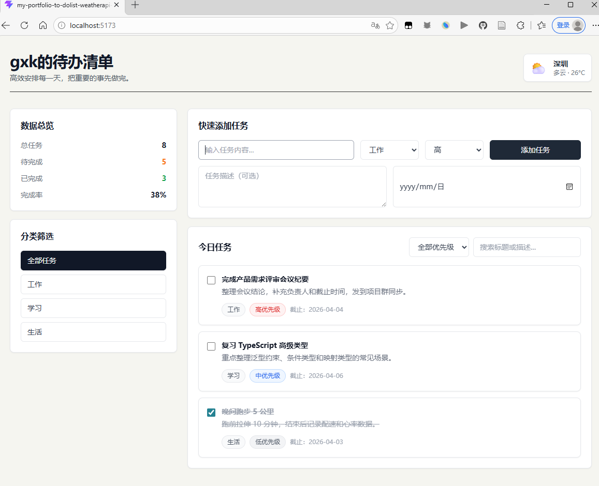
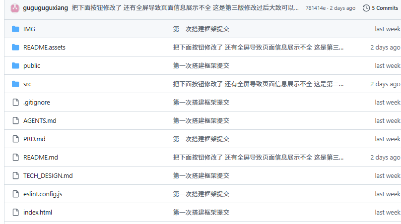

## [0开头]()

我准备写这个 代办清单，然后那个天气调用右上角留个组件来写吧（练习一下调用外部api）两个项目合到一起来学习。

==注意api 封装并且不能放到github上传==！

（配置 `.gitignore`）

如果你把代码上传到 GitHub 等代码仓库，如果不做这一步，你的 `.env` 文件也会被传上去，全世界都能看到你的 Key，黑客会用机器人一秒钟扫走你的余额。

找到项目根目录下的 `.gitignore` 文件（如果没有就新建一个），在里面加上一行代码，告诉 Git 工具“忽略这个文件，永远不要上传它”：

```python
# 忽略环境变量文件
.env
.env.local
```


## 1前期准备

终端指令初始化git仓库 --- 大模型辅助编写prd文档和TECH_DESIGN.md和 AGENTS.md 文件

## 2开始编写

简单写完项目框架和静态页面骨架之后提交一次git

```python
git add .
git commit -m "feat: 完成静态页面骨架与 UI 布局"
（###  关联远程仓库（在 GitHub 上新建一个空仓库）第一次提交之前需要先关联）
- 登录 GitHub，点击“New repository”。
- 输入仓库名（比如 `my-money-app`），不要勾选“初始化 README”，然后创建。
- 创建后会看到类似这样的提示，复制第二段代码（已有仓库的推送命令）：
  git remote add origin https://github.com/你的用户名/my-money-app.git
  git branch -M main
  git push -u origin main
  运行这两行命令，你的本地提交就会被推送到 GitHub 上。以后就可以在网页上看到代码了。
git push


#下一次提交只需这三个
git add .
git commit -m "说明"
git push
```



到这一步只是大致框架  静态页面完成了按钮什么的都点击不了


## 3细化细节

大致就是将 UI 与 Store 绑定让页面不是静态的以及增删改查和最后的天气api和大致修改小细节和美化界面

这一步完成了 所有按钮都可以点击

然后就是天气api

核心业务闭环后，最后攻克天气 API。这个时候你之前配置的 `.gitignore` 就派上大用场了。

[OpenWeather APIs for Weather, Energy, and Environment](https://openweathermap.org/)  这个网站获取api 日常学习调用几次够用了


==注意api 封装并且不能放到github上传==！ 下面操作

自己创建一个.env文件

```
VITE_WEATHER_API_KEY=你的api
```

然后再.gitignore加入  这样.env里面的api不会上传到git

```python
# 环境变量文件 (Environment Variables)
.env
.env.*
!.env.example
```


## 4遇到的问题

github每次commit提交感觉仓库好乱  第一次和第二次信息都显示如下



这是正常的  其实可以指令自动添加feat或者docs等等


| 类型            | 说明             | 使用场景示例                             |
| :-------------- | :--------------- | :--------------------------------------- |
| **`feat:`**     | 新功能 (Feature) | 添加了一个新的登录页面                   |
| **`fix:`**      | 修复 Bug         | 修复了密码重置功能的错误                 |
| **`docs:`**     | 文档更新         | 修改了 README 文件中的安装说明           |
| **`style:`**    | 代码格式         | 调整了代码缩进，删除了多余的空格         |
| **`refactor:`** | 代码重构         | 优化了数据处理模块的内部逻辑，但功能不变 |
| **`perf:`**     | 性能优化         | 改进了图片加载策略，提升了页面性能       |
| **`test:`**     | 测试相关         | 为购物车模块增加了单元测试               |
| **`chore:`**    | 构建/工具/依赖   | 将项目依赖的 Webpack 从 v4 升级到了 v5   |

```python
git commit -m "docs: update README with new setup guide"
git commit -m "fix: resolve null pointer exception in user login"
```

而为啥每次这些备注都是修改后的文件夹显示  

是因为我输入 git add. 将**当前目录及其所有子目录**中发生变动的文件（修改、新增、删除）添加到**暂存区（Staging Area）**

**`git commit -m "feat: 第n次提交 完成了啥"`**将**暂存区里所有内容**打包成一个“提交快照”，并附上你写的提交信息，所有只有更改过后的文件夹feat改变

**`git push`**把你本地仓库中**当前分支**上**新增的提交**（比如刚才 `commit` 产生的那个）上传到远程仓库（如 GitHub），让其他人能看到你的改动。

然后如果针对某个文件夹提交 `docs:` 或 `feat:`

```python
# 1. 只添加 docs 文件夹下的改动
git add docs/

# 2. 提交 docs 文件夹的改动，使用 docs 标签
git commit -m "docs: update README and guide"

# 3. 只添加 src 文件夹下的改动
git add src/

# 4. 提交 src 文件夹的改动，使用 feat 标签
git commit -m "feat: add new helper functions"

# 5. 一次 push 推送两个提交
git push
```

如何“针对所有文件但加上 `docs:` 标签”？或者一个文件（没有改动的放到暂存区）

✅ 方案一：使用“空提交”（`--allow-empty`）

这个命令会创建一个**没有任何文件改动**的提交，只包含提交信息（比如 `docs: ...`）。这个提交会被记录在项目历史中，但不会改变任何文件或文件夹的内容。

bash

```python
git commit --allow-empty -m "docs: 添加一个文档标签"
git push
```

**效果**：

- 在 GitHub 上查看**整个仓库的提交历史**时，会看到这个 `docs:` 提交。
- 但在查看**具体某个文件夹**（比如 `docs/`）的历史时，这个提交**不会出现**，因为它没有改动该文件夹里的任何文件。

**适用场景**：你想在项目 timeline 上记录一个“标记性”的事件（比如文档更新提醒），但不需要实际修改文件。

✅ 方案二：强制产生一个“无意义改动”后提交

如果你希望某个文件夹（比如 `docs/`）的**历史记录**里出现 `docs:` 标签，就必须让这个文件夹里的**至少一个文件**产生变动。最简单的办法：

```python
# 进入目标文件夹，创建一个临时文件或修改一个已有文件
touch docs/.dummy      # 创建一个空文件
git add docs/.dummy
git commit -m "docs: 标记文档文件夹"
git push

# 如果你觉得这个空文件碍眼，可以在下一次提交中删除它
```

或者更优雅的方式：**在已有的文档文件末尾添加一个空行或注释**：

```python
echo "" >> docs/README.md   # 添加一个空行
git add docs/README.md
git commit -m "docs: 更新文档标记"
git push
```


**效果**：`docs/` 文件夹的历史记录里就会多出一个 `docs:` 标签的提交，尽管内容变化可能无关紧要。

❓ 那“对所有文件夹无论改动与否都加上 docs 标签”能做到吗？

**技术上无法实现**。因为 Git 的提交是基于**实际内容的变化**。如果一个文件夹没有任何文件被修改，那么它在该提交中就没有新版本。无论你用什么命令，都无法让一个没有变化的文件夹“拥有”这次提交的记录。

你可以用**空提交**为整个项目添加一个标签，但这个标签不会出现在任何具体文件夹的历史里。

## 5重读ai代码学习里面的知识